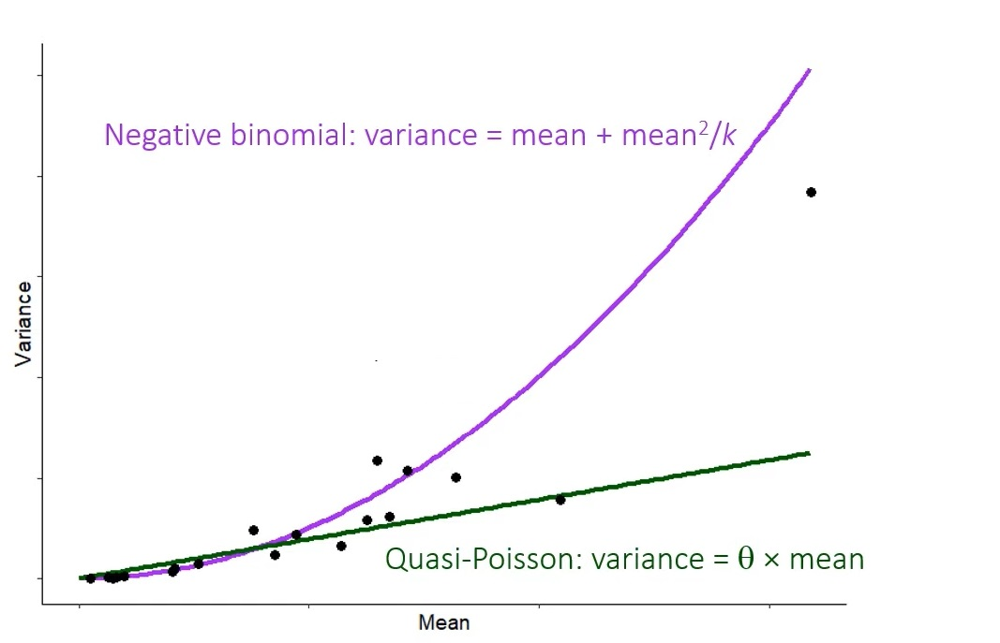

```{r setup, include=FALSE}
knitr::opts_chunk$set(echo = FALSE)
```

```{r, echo=FALSE, message=FALSE, warning=FALSE}
library(tidyverse)
library(tseries)
library(car)
library(moments)
library(AID)
library(leaflet)
library(hrbrthemes)
library(ggpubr)
library(ggpmisc)

```


## Introduction 

Suicide attacks are a growing phenomenon in the world, In the last 5 years, suicide attacks have become more and more common, and have been used in 40% of all conflicts in comparison to 4% in the 80s. In the past, there was a profile of people prone to commit suicide attacks - people without family, 20-30 years old, and students of religion. But today terrorism has evolved and a suicide bomber can be anyone at any time. A person who carries out a suicide attack is usually illogical and fanatical, but whoever sends the suicide attack does it with a calculated purpose.

Most suicide attacks do not occur as a single and unrelated case, they usually occur as part of a period of suicide attacks or several at the same time. The strategic logic of the suicide attacks works mainly against liberal democratic countries, influencing public opinion and exerting pressure on the government.
In this work, we will examine if indicators of human capital can affect the lethality of terrorist attacks.

## Our research question and hypothesis 

Is there a connection between human capital and the lethality of suicidal attacks? 

According to the literature we expect to see that indices like sex, age, and socioeconomic status will affect the lethality of suicidal attacks.

we expect that there is a strong relationship between older age and a higher unemployment rate to the lethality of suicide attacks.  In particular
women will be more lethal than men.

In addition, we expect to see a rise in the popularity of female suicide attacks, and we expect women to use more concealed weapons than men like belt bombs.

##  Our database

In our project we used "The Database on Suicide Attacks (DSAT)" from the University of Chicago it contains specific information for all suicide attacks committed in modern history, from 1982 to 2019. Event records in the DSAT are highly detailed and coded for over 60 variables (not including source information).

The variables are divided into five broad categories:

1. Basic information, including attack location, date, and casualty counts.

2. Target information, including target type category (security / political / civilian) and their relation to state or international infrastructure.

3. Attacker biographical information, including attacker name, age, gender, nationality, and religious affiliation.

4. Claim information, including a list of groups that explicitly claim or deny credit for an attack, as well as groups suspected of involvement.

5. Sources, including texts of news articles and wire service alerts used in coding the attack.


## Literature 1 - Human Capital and the Productivity of Suicide Bombers

 
Benmelech's and Berrebi's article (2017) provides the first detailed empirical analysis of the relationship
between suicide bomber's characteristics and their performance in a suicide bombing
attacks, The conclusion was that Palestinian terror organizations match older and
more-educated suicide bombers to more important Israeli targets, another conclusion was that older and more-educated suicide bombers kill more people in their suicide attacks
when assigned to important targets.
Furthermore, older and more-educated suicide bombers are less likely to fail or to be caught when they
attack.

This paper also contributes to the debate on the relation between education, poverty, and terrorism. While suicide bombers are on average more
educated than the general Palestinian population, their estimate of a higher
education among suicide bombers is three times lower than the figures reported by Berrebi
(2003) and Krueger and Maleckova (2003).

## Literature 2 - What’s Special about Female Suicide Terrorism?

O'Rourke's article (2009) analyzes the interaction between the motivations of individual attackers and terrorist group strategies.
To do so it combines a quantitative analysis of all known suicide terrorist attacks between 1981 and July 2008 with a strategic account of why terrorist
organizations employ female suicide terrorism and case studies of individual female attackers.
The author advances five main claims:

1)She reveals the superior effectiveness of female suicide terrorism from the perspective of the groups that employ women.

2)She explains that terrorist groups increasingly enlist women as suicide attackers because of their higher effectiveness.

3)She demonstrates that terrorist groups adapt their discourse, catering to the specific individual motives of potential female suicide attackers to recruit them.

4)She shows that female attackers are driven by the same general motives and circumstances that drive men.

5)She concludes that, unless target states adapt their defensive strategies, we should expect an increase in female suicide terrorism.

## Literature 3 - Economic Conditions and the Quality of Suicide Terrorism

In this article Benmelech et al.(2010) analyze the link between economic conditions and the lethality of suicide terrorism. literature up to that point showed that poverty and economic conditions didn't affect the quantity of terror.
Focusing on Palestinian suicide terrorists against Israeli targets between the years 2000 and 2006 they wanted to check the correlation between economic conditions the characteristics of suicide terrorists and the targets they attack.
They concluded that poor economic conditions and high unemployment enable terror organizations to recruit more educated, mature and experienced suicide terrorists who attack more important targets.  

## Literature 4 - Wolves in Sheep’s Clothing: Assessing the Effect of Gender Norms on the Lethality of Female Suicide Terrorism

In this research Thomas(2021) shows that the gender of the attackers and the gender norms in the country they made the attack influence the lethality of the attack using data on individual suicide attacks from 1985 to 2015.
She concluded that women are more lethal than men when it comes to suicide attacks but only in countries with restrictive gender norms and practices because in those countries women are seen as peaceful in character and apolitical therefore they don't seem like a threat to the people. And in countries where women are seen as equal to men they didn't have an edge when it comes to the lethality of the attack.

Moreover, Terrorists have also exploited the association between motherhood and innocence by deploying expectant mothers or women pretending to be pregnant in suicide attacks, by being pregnant or faking to be pregnant women can conceal their weapons (like vests and belts) more effectively also some scholars suggest that pregnancy may further discourage frisks, providing female terrorists greater cover.

## Interactive map of suicide attacks between 1982 and 2019

```{r}

points = read.csv("attacks.csv")
points = points[!is.na(points$latitude), ]
points = points[!is.na(points$longitude), ]

leaflet(data = points) %>%
  addTiles() %>%
  addMarkers(lat=points$latitude, lng=points$longitude, clusterOptions = markerClusterOptions(),
             popup= paste("<strong>Date: </strong>", points$date_day,"/",points$date_month,"/", points$date_year,
                          "<br><br><strong>Place: </strong>", points$city_txt,"-",points$admin0_txt,
                          "<br><strong>Killed_low_estimate: </strong>", points$killed_low,
                          "<br><strong>Killed_high_estimate: </strong>", points$killed_high,
                          "<br><strong>wounded_low_estimate: </strong>", points$wounded_low,
                          "<br><strong>wounded_high_estimate: </strong>", points$wounded_high,
                          "<br><strong>wepon: </strong>", points$weapon_txt
                          
                          
             ))
```


## Data Cleaning of attacks:


```{r}
attacks = read.csv("attacks.csv")
head(as_tibble(attacks))
```
 
After some data cleaning:
```{r}
attacks_new = as_tibble(attacks) %>%
  select(event_id,wounded_low,wounded_high,killed_low,killed_high,admin0_txt,date_year,weapon_txt) %>%
  filter(wounded_low >= 0) %>%
  filter(wounded_high >= 0) %>%
  filter(killed_low >= 0) %>%
  filter(killed_high >= 0) %>%
  mutate(wounded_average = ceiling(((wounded_low + wounded_high)/2) )) %>%
  mutate(killed_average = ceiling(((killed_low + killed_high)/2) )) %>% 
  mutate(casualties = wounded_average + killed_average) %>%
  filter(casualties < 500) %>%
  rename( country = admin0_txt) %>%
  select(event_id,casualties,country,date_year,weapon_txt)
head(attacks_new)
```


## Data Cleaning of attackers:
```{r}

attackers = read.csv("attackers.csv")
head(attackers)
```

after some data cleaning:
```{r}
attackers_new = attackers %>%
  as_tibble() %>%
  select(event_id,attacker_id,age_time_death,gender,birth_admin0_txt) %>%
  rename(birth_city = birth_admin0_txt) %>%
  filter(age_time_death > 0) %>%
  filter(gender %in% c("Male" , "Female") )
head(attackers_new)

```

## Normality visualtization:

```{r,echo=FALSE, message=FALSE, warning=FALSE}
attacks_new %>%
  ggplot( aes(x=casualties)) +
    geom_histogram( binwidth=10, fill="#0afa4a", color="#fa0a0a", alpha=0.9) +
    ggtitle("need to add ") +
    theme_ipsum() +
    theme(
      plot.title = element_text(size=15)
    )

```

The data is in Poisson distribution, we have a massive positive right skew. 

```{r,echo=FALSE, message=FALSE, warning=FALSE}
qqPlot(attacks_new$casualties, id= FALSE)
```


## Square root data transformation - Log(10) data transformation - Inverse data transformation:

```{r,echo=FALSE, message=FALSE, warning=FALSE}
i = attacks_new %>%
  ggplot( aes(x=sqrt(casualties + 1 ))) +
    geom_histogram( binwidth = 1 , fill="#0afa4a", color="#fa0a0a", alpha=0.9) +
    ggtitle("need to add ") +
    theme_ipsum() +
    theme(
      plot.title = element_text(size=15)
    )


o = attacks_new %>%
  ggplot( aes(x=log(casualties + 1 ))) +
    geom_histogram( binwidth = 1 , fill="#0afa4a", color="#fa0a0a", alpha=0.9) +
    ggtitle("need to add ") +
    theme_ipsum() +
    theme(
      plot.title = element_text(size=15)
    )


p = attacks_new %>%
  ggplot( aes(x=1/(casualties + 1 ))) +
    geom_histogram( binwidth = 1 , fill="#0afa4a", color="#fa0a0a", alpha=0.9) +
    ggtitle("need to add ") +
    theme_ipsum() +
    theme(
      plot.title = element_text(size=15)
    )

q = attacks_new %>%
  ggplot( aes(x=log10(casualties + 1 ))) +
    geom_histogram( binwidth = 1 , fill="#0afa4a", color="#fa0a0a", alpha=0.9) +
    ggtitle("need to add ") +
    theme_ipsum() +
    theme(
      plot.title = element_text(size=15)
    )

figure <- ggarrange(i, o, q, p,
                    labels = c("A", "B", "C","D"),
                    ncol = 2, nrow = 2)
figure
```


## log 10 and log looks like normal distribution, but what’s the problem?

```{r}
agostino.test(log10(attacks_new$casualties+1))
agostino.test(log(attacks_new$casualties+1))

```

too many repetitions! 

```{r}

qqPlot(log10(attacks_new$casualties+1),id= FALSE)
qqPlot(log(attacks_new$casualties+1),id= FALSE)

```

## Poisson vs quasi-Poisson vs negative binomial distribution

Our data has a Poisson distribution. The problem with Poisson distribution is that it is rather inflexible in the fact that it assumes that mean is equal to variance, if this assumption is not met, our distrebution might be quasi-Poisson, or negative binomial distribution

```{r}

mean(attacks_new$casualties) 
var(attacks_new$casualties)

a = attacks_new %>%
  filter(casualties < 100)
b = attacks_new %>%
  filter(casualties < 200 & casualties > 100 )
c = attacks_new %>%
  filter(casualties < 300 & casualties > 200 )
d = attacks_new %>%
  filter(casualties < 400 & casualties > 300 )
e = attacks_new %>%
  filter(casualties < 500 & casualties > 400)

mean(a$casualties)
var(a$casualties)
mean(b$casualties)
var(b$casualties)
mean(c$casualties)
var(c$casualties)
mean(d$casualties) 
var(d$casualties)
mean(e$casualties)
var(e$casualties)

mean1 = c(17.4095,
         137.9321,
         237.1207,
         338,
         452.8
)

var1  = c(379.039,
         749.7151,
         799.3711,
         974.4286,
         1298.622
) 

df <- data.frame(mean1, var1)


ggplot(data = df, aes(x = mean1, y = var1)) +
  stat_poly_line() +
  stat_poly_eq(aes(label = after_stat(eq.label))) +
  stat_poly_eq(label.y = 0.9) +
  geom_point()


```


## Poisson vs quasi-Poisson vs negative binomial distribution P2

The variance of a quasi-Poisson model is a linear function of the mean while the variance of a negative binomial model is a quadratic function of the mean. These variance relationships affect the weights in the iteratively weighted least-squares algorithm of fitting models to data.



## Male vs female count graph

```{r}
attacks_graph = attacks_new %>%
  left_join(attackers_new, by =  "event_id") %>%
  select(date_year,gender,country,weapon_txt) %>%
  arrange(desc(date_year)) %>%
  add_count(date_year) 
  
attacks_graph_male = attacks_graph %>%
  filter(gender == "Male") %>%
  select(date_year,gender,country,weapon_txt) %>%
add_count(date_year) 

attacks_graph_female = attacks_graph %>%
  filter(gender == "Female") %>%
  select(date_year,gender,country,weapon_txt) %>%
  add_count(date_year) 

ggplot(data = attacks_graph) + 
  geom_point(mapping = aes(x = date_year, y = n)) +
  geom_line(mapping = aes(x = date_year, y = n))

ggplot(NULL, aes(date_year, n)) + 
  geom_line(data=attacks_graph_male, col="blue")+
  geom_line(data=attacks_graph_female, col="red")

ggplot(NULL, aes(date_year, n)) + 
geom_smooth(data=attacks_graph_male, col="blue")+
  geom_smooth(data=attacks_graph_female, col="red")


```

## male vs female weapons
```{r}
attacks_wepon = attacks_graph %>%
  count(weapon_txt) %>%
  mutate(precentage = (n/sum(n)*100))
attacks_wepon

attacks_wepon_male = attacks_graph_male %>%
  count(weapon_txt)  %>%
rename(n_male =n) 


attacks_wepon_female = attacks_graph_female %>%
  count(weapon_txt)  %>%
  rename(n_female =n)

ggplot(attacks_wepon, aes(x=weapon_txt, y=n)) + 
  geom_bar(stat = "identity") +
  coord_flip()
 

comb_wepons = left_join(attacks_wepon_male,attacks_wepon_female, by = "weapon_txt")
sum(comb_wepons$n_male, na.rm = TRUE)
sum(comb_wepons$n_female, na.rm = TRUE)

comb_wepons

prop.test(x = c(84, 314), n = c(155, 674))
prop.test(x = c(4, 17), n = c(155, 674))
prop.test(x = c(18, 60), n = c(155, 674))
prop.test(x = c(10, 151), n = c(155, 674))
```

## comparisson_world
```{r}
male_attackers = attackers_new %>%
filter(gender == "Male") %>%
inner_join(attacks_new, by =  "event_id") %>%
select(age_time_death,casualties,gender,birth_city)

female_attackers = attackers_new %>%
filter(gender == "Female") %>%
inner_join(attacks_new, by =  "event_id") %>%
select(age_time_death,casualties,gender,birth_city)

both_gender1 = bind_rows(male_attackers,female_attackers) %>%
  select(gender,casualties,birth_city  )
test <- wilcox.test(both_gender1$casualties ~ both_gender1$gender)
test 
ggplot(both_gender1, aes(x= casualties, color=gender)) +
  geom_histogram(fill="white")
```

## comparisson_sri_lanka
```{r}
both_gender2 =  both_gender1 %>%
  filter(birth_city ==  "Sri Lanka") %>%
  select(gender, casualties)
test2 <- wilcox.test(both_gender2$casualties ~ both_gender2$gender)
test2 
ggplot(both_gender2, aes(x= casualties, color=gender)) +
  geom_histogram(fill="white")
```

## comparisson_Russia
```{r}
both_gender3 =  both_gender1 %>%
  filter(birth_city ==  "Russia") %>%
  select(gender, casualties)
test2 <- wilcox.test(both_gender3$casualties ~ both_gender3$gender)
test2 
ggplot(both_gender3, aes(x= casualties, color=gender)) +
  geom_histogram(fill="white")
```

## sri_ lanka _ male
```{r}
sri_lanka_male = read.csv("Sri_Lanka_Male.csv")
sri_lanka_female = read.csv("Sri_Lanka_Female.csv")
attacks_sri_lanka_man =  attackers_new %>%
filter(gender == "Male") %>%
  filter(birth_city == "Sri Lanka") %>%
  inner_join(attacks_new, by = "event_id") %>%
filter(country == birth_city) %>%
  rename(Year = date_year) %>%
  inner_join(sri_lanka_male, by = "Year")

t1= glm(casualties ~  age_time_death + Education_Index + GDP  + Unemployment_Male, data = attacks_sri_lanka_man , family = "quasipoisson"	)
summary(t1)


cor.test(attacks_sri_lanka_man$casualties,attacks_sri_lanka_man$age_time_death, method="kendall")
cor.test(attacks_sri_lanka_man$casualties,attacks_sri_lanka_man$Education_Index, method="kendall")
cor.test(attacks_sri_lanka_man$casualties,attacks_sri_lanka_man$GDP, method="kendall")
cor.test(attacks_sri_lanka_man$casualties,attacks_sri_lanka_man$Unemployment_Male, method="kendall")


```

## sri_ lanka _ female

```{r}
attacks_sri_lanka_female =  attackers_new %>%
  filter(gender == "Female") %>%
  filter(birth_city == "Sri Lanka") %>%
  inner_join(attacks_new, by = "event_id") %>%
  filter(country == birth_city) %>%
  rename(Year = date_year) %>%
  inner_join(sri_lanka_female, by = "Year")
t2= glm(casualties ~  age_time_death + Education_Index + GDP  + Unemployment_Female, data = attacks_sri_lanka_female , family = "quasipoisson"	)
summary(t2)

cor.test(attacks_sri_lanka_female$casualties,attacks_sri_lanka_female$age_time_death, method="kendall")
cor.test(attacks_sri_lanka_female$casualties,attacks_sri_lanka_female$Education_Index, method="kendall")
cor.test(attacks_sri_lanka_female$casualties,attacks_sri_lanka_female$GDP, method="kendall")
cor.test(attacks_sri_lanka_female$casualties,attacks_sri_lanka_female$Unemployment_Female, method="kendall")
```

## russia_man 
```{r}
russia_male = read.csv("Russia_Male.csv")
russia_female = read.csv("Russia_Female.csv")
attacks_russia_male =  attackers_new %>%
  filter(gender == "Male") %>%
  filter(birth_city == "Russia") %>%
  inner_join(attacks_new, by = "event_id") %>%
  filter(country == birth_city) %>%
  rename(Year = date_year) %>%
  inner_join(russia_male, by = "Year")
t3= glm(casualties ~  age_time_death + Education_Index + GDP  + Unemployment_Male, data = attacks_russia_male , family = "quasipoisson"	)
summary(t3)

cor.test(attacks_russia_male$casualties,attacks_russia_male$age_time_death, method="kendall")
cor.test(attacks_russia_male$casualties,attacks_russia_male$Education_Index, method="kendall")
cor.test(attacks_russia_male$casualties,attacks_russia_male$GDP, method="kendall")
cor.test(attacks_russia_male$casualties,attacks_russia_male$Unemployment_Male, method="kendall")

```

## russia_female
```{r}
attacks_russia_female =  attackers_new %>%
  filter(gender == "Female") %>%
  filter(birth_city == "Russia") %>%
  inner_join(attacks_new, by = "event_id") %>%
  filter(country == birth_city) %>%
  rename(Year = date_year) %>%
  inner_join(russia_female, by = "Year")
t4= glm(casualties ~  age_time_death + Education_Index + GDP  + Unemployment_Female, data = attacks_russia_female , family = "quasipoisson"	)
summary(t4)

cor.test(attacks_russia_female$casualties,attacks_russia_female$age_time_death, method="kendall")
cor.test(attacks_russia_female$casualties,attacks_russia_female$Education_Index, method="kendall")
cor.test(attacks_russia_female$casualties,attacks_russia_female$GDP, method="kendall")
```

## Ze_worldo_man
```{r}
world_man = read.csv("World_Male.csv")
attacks_world_male =  attackers_new %>%
  filter(gender == "Male") %>%
  inner_join(attacks_new, by = "event_id") %>%
  filter(country == birth_city) %>%
  rename(Year = date_year) %>%
  inner_join(world_man, by = "Year")

t5= glm(casualties ~  age_time_death + Education_Index + GDP  + Unemployment_Male, data = attacks_world_male , family = "quasipoisson"	)

summary(t5)

cor.test(attacks_world_male$casualties,attacks_world_male$age_time_death, method="kendall")
cor.test(attacks_world_male$casualties,attacks_world_male$Education_Index, method="kendall")
cor.test(attacks_world_male$casualties,attacks_world_male$GDP, method="kendall")
```

## Ze_worldo_female
```{r}
world_female = read.csv("World_Female.csv")
attacks_world_female =  attackers_new %>%
  filter(gender == "Female") %>%
  inner_join(attacks_new, by = "event_id") %>%
  filter(country == birth_city) %>%
  rename(Year = date_year) %>%
  inner_join(world_man, by = "Year")

t6= glm(casualties ~  age_time_death + Education_Index + GDP  + Unemployment_Male, data = attacks_world_female , family = "quasipoisson"	)

summary(t6)

cor.test(attacks_world_female$casualties,attacks_world_female$age_time_death, method="kendall")
cor.test(attacks_world_female$casualties,attacks_world_female$Education_Index, method="kendall")
cor.test(attacks_world_female$casualties,attacks_world_female$GDP, method="kendall")
```


